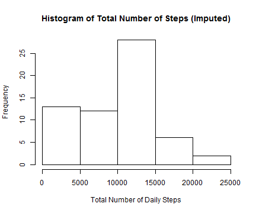

# Reproducible Research: Peer Assessment 1


## Loading and preprocessing the data
Download data from the web and unzip raw data.  Read the csv file into a dataframe and provide a summary of the data.

```r
### Data retrieved from
### https://d396qusza40orc.cloudfront.net/repdata%2Fdata%2Factivity.zip The
### data is downloaded and unzipped into the current working direcory to
### create activity file.

## Download the file
file.url <- "https://d396qusza40orc.cloudfront.net/repdata%2Fdata%2Factivity.zip"
my.file <- "./repdata_data_activity.zip"

setInternet2(TRUE)
download.file(file.url, my.file)
unzip(my.file)

raw.df <- read.csv(file = "./activity.csv", colClasses = c("integer", "character", 
    "integer"))
cat("Data frame overview\n")
```

```
## Data frame overview
```

```r
cat("Data retrieved on", format(Sys.time(), "%m/%d/%Y %H:%M:%S"))
```

```
## Data retrieved on 05/10/2014 21:32:04
```

```r
str(raw.df)
```

```
## 'data.frame':	17568 obs. of  3 variables:
##  $ steps   : int  NA NA NA NA NA NA NA NA NA NA ...
##  $ date    : chr  "2012-10-01" "2012-10-01" "2012-10-01" "2012-10-01" ...
##  $ interval: int  0 5 10 15 20 25 30 35 40 45 ...
```


Keep only complete observations

```r
complete.df <- na.omit(raw.df)
cat("Number of complete rows:", dim(complete.df)[1])
```

```
## Number of complete rows: 15264
```


## What is mean total number of steps taken per day?
Calculate the total number steps per day.

```r
steps.day <- by(complete.df$steps, complete.df$date, sum)
```


```r
hist(steps.day, main = "Histogram of Total Number of Steps", xlab = "Total Number of Daily Steps")
```

 


Calculate mean and median total number of steps per day.

```r
mean.total.steps <- mean(steps.day)
median.total.steps <- median(steps.day)
```


* Mean total number of steps taken per day is **10766.189**
* Median total number of steps taken per day is **10765**


## What is the average daily activity pattern?
Now calculate the average interval activty over the course of a day.

```r
## calculate average number of steps in an interval over all days
interval.steps <- tapply(complete.df$steps, complete.df$interval, mean)
head(interval.steps)
```

```
##       0       5      10      15      20      25 
## 1.71698 0.33962 0.13208 0.15094 0.07547 2.09434
```


Plot of activity over daily interval

```r
## convert character interval names to numeric values
interval <- as.integer(rownames(interval.steps))

## generate line chart
plot(interval, interval.steps, type = "l", main = "Average Daily Activity Pattern", 
    ylab = "Average number of steps", xlab = "Interval")
```

 


Determine interval with the maximum value.

```r
max.steps.idx <- which(interval.steps == max(interval.steps))
```


Five-minute interval "835" has the maximum average number of steps of 206.1698.

## Imputing missing values
There are 2304 observations with missing values.

The strategy for imputing missing values is to use the median steps for each 
interval across the days.  First we calculate the median for each interval.


```r
interval.median.steps <- tapply(raw.df$steps, raw.df$interval, median, na.rm = TRUE)
```

Here is a sample of the interval medians that will be used for imputation.

```r
## sample of median values
n <- as.integer(0.75 * length(interval.median.steps))
interval.median.steps[n:(n + 5)]
```

```
## 1755 1800 1805 1810 1815 1820 
##   10   15   18   26   25   24
```


The procedure for imputing missing values is to find missing values for each 
interval and to replace any missing values with the median calculated for that 
interval.


```r
## get valid values for all intervals
intervals <- unique(raw.df$interval)

## make copy of raw data
imputed.df <- raw.df

## cycle thru the intervals and replace missing values
for (intvl in intervals) {
    ## get median value for specific interval
    median.value <- interval.median.steps[names(interval.median.steps) == intvl]
    
    ## replace missing missing values
    imputed.df[imputed.df$interval == intvl & is.na(imputed.df$steps), "steps"] <- median.value
}
```


Summary of the original raw data.

```
##      steps           date              interval   
##  Min.   :  0.0   Length:17568       Min.   :   0  
##  1st Qu.:  0.0   Class :character   1st Qu.: 589  
##  Median :  0.0   Mode  :character   Median :1178  
##  Mean   : 37.4                      Mean   :1178  
##  3rd Qu.: 12.0                      3rd Qu.:1766  
##  Max.   :806.0                      Max.   :2355  
##  NA's   :2304
```

Summary of the data after imputing median values for missing values.

```
##      steps         date              interval   
##  Min.   :  0   Length:17568       Min.   :   0  
##  1st Qu.:  0   Class :character   1st Qu.: 589  
##  Median :  0   Mode  :character   Median :1178  
##  Mean   : 33                      Mean   :1178  
##  3rd Qu.:  8                      3rd Qu.:1766  
##  Max.   :806                      Max.   :2355
```


This is the histogram with imputed values.

```r
steps2.day <- by(imputed.df$steps, imputed.df$date, sum)
```


```r
hist(steps2.day, main = "Histogram of Total Number of Steps (Imputed)", xlab = "Total Number of Daily Steps")
```

 


We re-calculate mean and median total number of steps per day after imputing
missing values.

```r
mean.total.steps2 <- mean(steps2.day)
median.total.steps2 <- median(steps2.day)
```

Revised values after imputation are
* Mean total number of steps taken per day is **9503.869**
* Median total number of steps taken per day is **10395**

The effect of imputing mising values resulted in lowering both the mean and median
values.

## Are there differences in activity patterns between weekdays and weekends?

We now determine if there is a difference between activity during the week versus 
the weekend.

First we enrich the data with an indicator for **weekday** (Monday through Friday) 
or **weekend** (Saturday and Sunday).

```r
imputed.df$weekday.ind <- factor(ifelse(weekdays(as.Date(imputed.df$date)) %in% 
    c("Saturday", "Sunday"), "weekend", "weekday"))

## overview of enriched data
str(imputed.df)
```

```
## 'data.frame':	17568 obs. of  4 variables:
##  $ steps      : int  0 0 0 0 0 0 0 0 0 0 ...
##  $ date       : chr  "2012-10-01" "2012-10-01" "2012-10-01" "2012-10-01" ...
##  $ interval   : int  0 5 10 15 20 25 30 35 40 45 ...
##  $ weekday.ind: Factor w/ 2 levels "weekday","weekend": 1 1 1 1 1 1 1 1 1 1 ...
```

```r

## calculate average number of steps in an interval over all days
interval2.steps <- data.frame(tapply(imputed.df$steps, list(imputed.df$interval, 
    imputed.df$weekday.ind), mean))

interval2.steps$interval <- as.integer(rownames(interval2.steps))


## reshape the data from plotting
library(reshape2)
interval2.df <- melt(interval2.steps, id = c("interval"), measure.vars = c("weekend", 
    "weekday"))

names(interval2.df)[2:3] <- c("timeperiod", "steps")
```

Overview of the enriched data for plotting.

```r
str(interval2.df)
```

```
## 'data.frame':	576 obs. of  3 variables:
##  $ interval  : int  0 5 10 15 20 25 30 35 40 45 ...
##  $ timeperiod: Factor w/ 2 levels "weekend","weekday": 1 1 1 1 1 1 1 1 1 1 ...
##  $ steps     : num  0 0 0 0 0 3.25 0 0 0 0.375 ...
```

```r
head(interval2.df, 3)
```

```
##   interval timeperiod steps
## 1        0    weekend     0
## 2        5    weekend     0
## 3       10    weekend     0
```

```r
tail(interval2.df, 3)
```

```
##     interval timeperiod  steps
## 574     2345    weekday 0.1778
## 575     2350    weekday 0.2667
## 576     2355    weekday 1.2667
```


The following plot compares the activity for weekdays vs weekends.

```r
library(lattice)
xyplot(steps ~ interval | timeperiod, data = interval2.df, type = "l", ylab = "Number of steps", 
    layout = c(1, 2))
```

 


